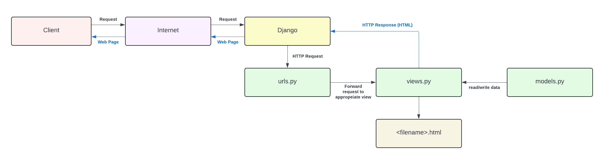
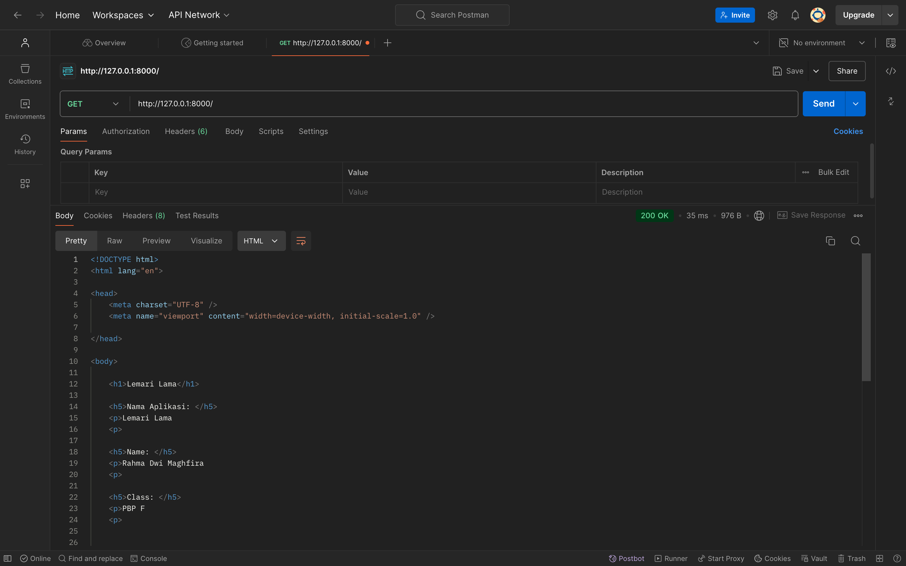
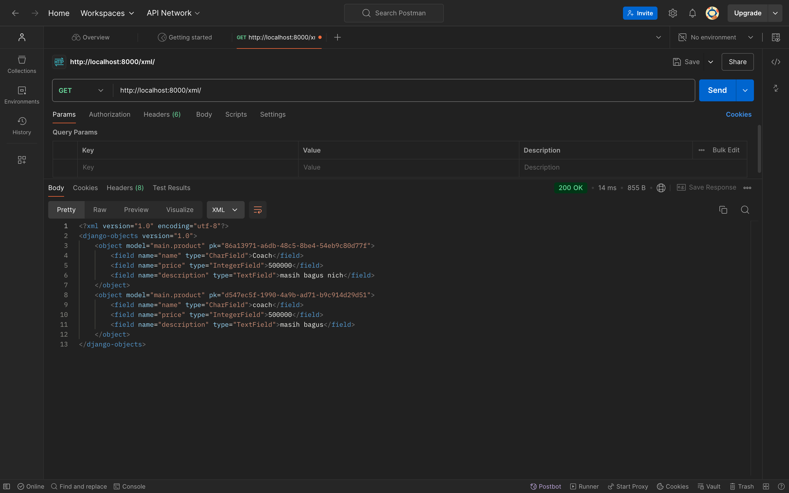
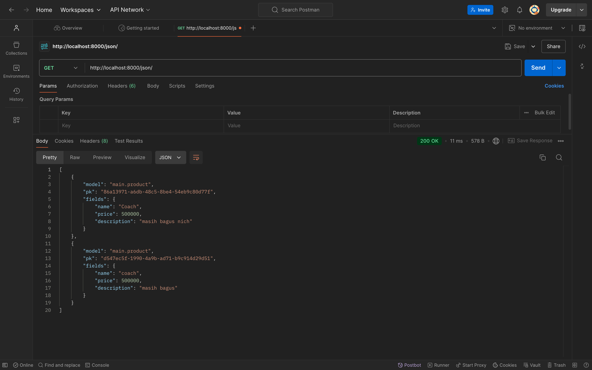

# Lemari Lama 

Rahma Dwi Maghfira  
2306245794  
PBP F

Link Menuju Project : http://rahma-dwi31-lemarilama.pbp.cs.ui.ac.id
Link Menuju Repository : https://github.com/rahmafira01/lemarilama.git  

# Tugas 2: Implementasi Model-View-Template (MVT) pada Django
## Jelaskan bagaimana cara kamu mengimplementasikan checklist di atas secara step-by-step (bukan hanya sekedar mengukuti tutorial). 
### 1. Membuat Proyek Django 
Untuk membuat project Django, hal pertama yang saya lakukan adalah menginisiasi git pada direktori utama "lemarilama" dan juga menghubungkan repository github dengan direktori tersebut. Selanjutnya, saya membuat dan mengaktifkan virtual envoirment dengan perintah ```python3 -m venv env``` dan ```source env/bin/activate```, kemudian menginstal dependencies yang tercantum dalam ```requirements.txt```. Setelah itu, saya membuat proyek Django baru dengan perintah ```django-admin startproject lemarilama``` dan mengonfigurasi ```ALLOWED_HOST``` di ```settings.py``` menjadi ```["localhost", "127.0.0.1"]```. Saya menjalankan server Django menggunakan ```python3 manage.py runserver```, dan memeriksa apakah proyek berhasil dengan membuka (http://localhost:8000), lalu menghentikan server dan menonaktifkan virtual environment. Terakhir, saya membuat file ```.gitignore``` untuk menentukan file yang harus diabaikan oleh Git, dan melakukan commit serta push ke repository Github.

### 2. Membuat aplikasi dengan nama *main*
Setelah berhasil membuat proyek Django dan memastikan virtual environment tetap aktif, langkah selanjutnya yang saya lakukan adalah menjalankan perintah ```python3 manage.py startapp main``` untuk membuat aplikasi baru dengan nama "main". Perintah ini akan menghasilkan direktori baru dengan nama "main" yang berisi struktur awal aplikasi Django. Kemudian, saya membuka berkas ```settings.py``` di dalam direktori "lemarilama" dan menambahkan *'main'* ke dalam daftar aplikasi di ```INSTALLED_APPS```. 

### 3. Melakukan *routing* pada proyek
Untuk mendaftarkan aplikasi *main* ke dalam proyek, saya membuka berkas ```settings.py``` di direktori lemarilama dan menambahkan *'main'* ke dalam daftar aplikasi di variabel ```INSTALLED_APPS``` sebagai elemen terakhir.  

### 4. Membuat model pada aplikasi dengan atribut *name*, *price*, dan *description*
Setelah melakukan *routing* pada proyek *main*, saya mengubah berkas ```models.py``` dalam aplikasi *main* untuk mendefinisikan model baru bernama ```Product``` dengan atribut *name*, *price*, dan *description*, serta metode ```is_pricey_price``` untuk menentukan apakah harga produk melebihi 10000.

### 5. Membuat fungsi pada *views.py* untuk dikembalikan ke *template*
Karena pada berkas ```views.py``` sudah memiliki import yang diperlukan, maka saya langsung mengubah data yang ada di dalam dictionary ```context``` pada fungsi ```show_main``` dengan data baru seperti *aplikasi*, *nama*, dan *kelas*. Fungsi ini kemudian menggunakan render untuk menampilkan tampilan dengan berkas template ```main.html``` yang sesuai. 

### 6. Membuat *routing* di *urls.py* untuk memetakan fungsi dari *views.py*
Setelah membuat aplikasi *main*, langkah selanjutnya yang saya lakukan adalah mengatur *routing* URL dengan membuat berkas ```urls.py``` di direktori *main* dan menambahkan rute untuk tampilan ```show_main```. Selanjutnya, saya mengimpor fungsi ```include``` di berkas ```urls.py``` proyek *lemarilama* dan menambahkan rute untuk aplikasi *main* dalam ```urlspatterns```. 

### 7. *deployment* ke PWS
Agar dapat dilihat oleh orang lain, hal pertama yang saya lakukan adalah menekan tombol *Create New Project* lalu mengisi *Project Name* dengan lemarilama, kemudian menekan tombol *Create New Project*. Selanjutnya, saya memasukkan URL *deployments* PWS saya ke variabel ```ALLOWED_HOSTS``` di berkas ```settings.py```. Setelah melakukan semua perubahan, saya melakukan git add, commit, dan push ke Github dan PWS untuk memastikan proyek dapat diakses publik. 

## Buatlah bagan yang berisi request client ke web aplikasi berbasis Django beserta responnya dan jelaskan pada bagan tersebut kaitan antara *urls.py*, *views.py*, *models.py*, dan berkas *html*.


## Jelaskan fungsi git dalam pengembangan perangkat lunak!
Git berfungsi sebagai sistem pengendalian versi yang digunakan dalam pengembangan perangkat lunak untuk melacak perubahan kode, menyimpan versi proyek, dan memfasilitasi kolaborasi antar anggota tim. Dengan Git, perubahan yang dilakukan dapat dicatat secara rinci, memungkinkan rollback ke versi sebelumnya jika diperlukan, serta meminimalkan risiko konflik kode saat bekerja dalam tim. Git juga memastikan pengelolaan proyek yang efisien. 

## Menurut Anda, dari semua framework yang ada, mengapa framework Django dijadikan permulaan pembelajaran pengembangan perangkat lunak?
Menurut saya, framework Django dijadikan sebagai permulaan dalam pembelajaran perangkat lunak karena framework ini menggunakan bahasa Python, yang dikenal sederhana dan mudah dipahami. Django menerapkan pola arsitektur Model-View-Template (MVT), yang memudahkan pemisahan logika antara Model, View, dan Template. Selain itu, platform Django ini mempunyai banyak fitur bawaan yang siap untuk digunakan sehingga cocok untuk para pemula.

## Mengapa model pada Django disebut sebagai ORM?
Model pada Django disebut sebagai ORM (Object-Relational Mapping) karena memungkinkan pengembang berinteraksi dengan basis data relasional menggunakan objek Python. ORM berfungsi menghubungkan antara model Python dan tabel di database, sehingga pengembang dapat mengelola data tanpa menulis SQL secara langsung. Hal ini mempermudah pengelolaan dan manipulasi data dalam database secara lebih efisien dan terstruktur.  


# Tugas 3: Implementasi Form dan Data Delivery pada Django
## Jelaskan bagaimana cara kamu mengimplementasikan checklist di atas secara step-by-step (bukan hanya sekadar mengikuti tutorial).
### 1. Membuat forms untuk input
Hal pertama yang saya lakukan adalah membuat ```forms.py``` untuk mendefinisikan form berbasis model ```Product```. Setelah itu, saya menambahkan fungsi ```create_product``` di ```views.py``` untuk memproses dan menyimpan data form. Kemudian, saya mengedit ```urls.py``` untuk menambahkan *URL path* ke form tersebut. Selanjutnya, saya membuat ```create_product.html``` untuk menampilkan form input, dan memperbarui ```main.html``` agar menampilkan data product dalam tabel serta menambahkan tombol untuk membuka form. Terakhir, saya menjalankan server dan menguji fungsionalitasnya.
### 2. Tambahkan 4 fungsi views baru untuk melihat objek yang sudah ditambahkan dalam format XML, JSON, XML by ID, dan JSON by ID.
* Format XML  
Langkah awal yang saya lakukan adalah menambahkan impor ```HttpResponse``` dan ```serializers``` di ```views.py```, lalu membuat fungsi ```show_xml``` untuk mengambil data Product dan menyerialisasinya menjadi XML. Hasilnya dikembalikan sebagai ```HttpResponse``` dengan ```content_type="application/xml"```.  
* Format JSON  
Langkah-langkah untuk implementasi JSON tidak jauh berbeda dari XML. Perbedaannya hanya terletak pada penggunaan ```content_type="application/json"``` dan ```serializers.serialize("json", data)```  
* Format XML by ID dan JSON by ID  
Sebenarnya, langkah-langkahnya mirip dengan yang dilakukan untuk menampilkan data XML dan JSON secara umum, hanya saja kali ini fokus pada data berdasarkan ID. Pertama, saya membuat dua fungsi baru di ```views.py```: ```show_xml_by_id``` dan ```show_json_by_id```. Fungsi-fungsi ini mengambil data dari Product berdasarkan ID yang diberikan menggunakan ```Product.objects.filter(pk=id)```. Data tersebut kemudian diserialisasi menjadi format XML atau JSON, sesuai dengan fungsi yang dipanggil, dan dikembalikan sebagai ```HttpResponse``` dengan ```content_type``` yang sesuai. Setelah itu, saya mengimpor kedua fungsi tersebut di ```urls.py``` dan menambahkan path URL yang sesuai untuk masing-masing fungsi.   
### 3. Membuat routing URL 
```
urlpatterns = [
    path('', show_main, name='show_main'),
    path('create-product', create_product, name='create_product'),
    path('xml/', show_xml, name='show_xml'),
    path('json/', show_json, name='show_json'),
    path('xml/<str:id>/', show_xml_by_id, name='show_xml_by_id'),
    path('json/<str:id>/', show_json_by_id, name='show_json_by_id'),
]
```
## Jelaskan mengapa kita memerlukan data delivery dalam pengimplementasian sebuah platform?
Data delivery diperlukan dalam pengimplementasian sebuah platform untuk memastikan bahwa data dapat dikirimkan dengan efisien dan aman antara berbagai komponen sistem atau ke pengguna akhir. Ini mendukung integritas data, meningkatkan performa aplikasi, dan memungkinkan interaksi yang lancar antara sistem yang berbeda. Tanpa mekanisme data delivery yang baik, platform akan mengalami masalah dalam konsistensi data, performa, dan keamanan.

## Menurutmu, mana yang lebih baik antara XML dan JSON? Mengapa JSON lebih populer dibandingkan XML?
JSON lebih disukai dibandingkan XML karena formatnya lebih ringan, lebih mudah dibaca, dan lebih efisien dalam pemrosesan serta ukuran data. JSON juga lebih populer karena dukungan luas di berbagai bahasa pemrograman dan API.

## Jelaskan fungsi dari method is_valid() pada form Django dan mengapa kita membutuhkan method tersebut?
Method is_valid() pada form Django berfungsi untuk memvalidasi input pengguna sesuai dengan aturan yang telah ditetapkan di form. Ini memastikan data yang diterima sudah benar dan aman sebelum diproses atau disimpan.

## Mengapa kita membutuhkan csrf_token saat membuat form di Django? Apa yang dapat terjadi jika kita tidak menambahkan csrf_token pada form Django? Bagaimana hal tersebut dapat dimanfaatkan oleh penyerang?
 adalah token keamanan yang dihasilkan secara otomatis oleh Django untuk mencegah serangan Cross-Site Request Forgery (CSRF). Token ini memastikan bahwa permintaan yang dikirimkan ke server berasal dari sumber yang sah dan bukan dari penyerang yang mencoba mengelabui pengguna. 

## Screenshot Postman
### 1. HTML Source  

### 2. XML  

### 3. JSON  

### 4. XML by ID  

### 5. JSON by ID  
